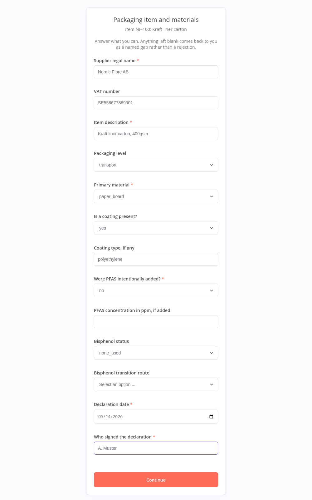
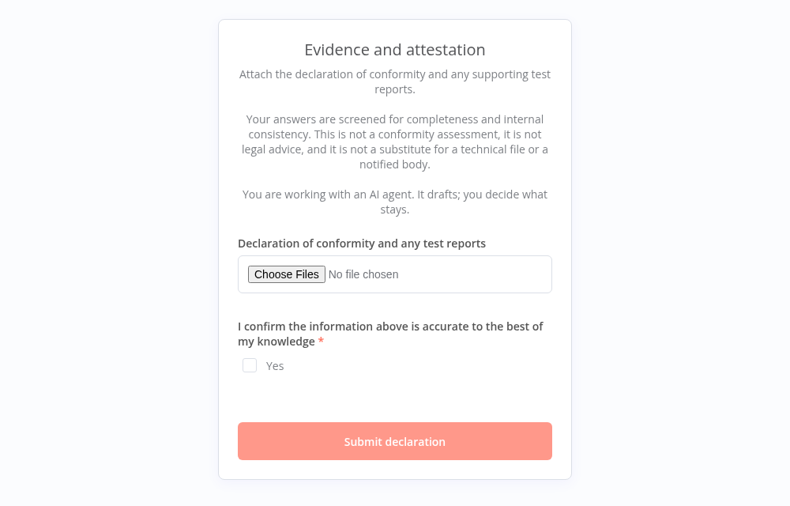
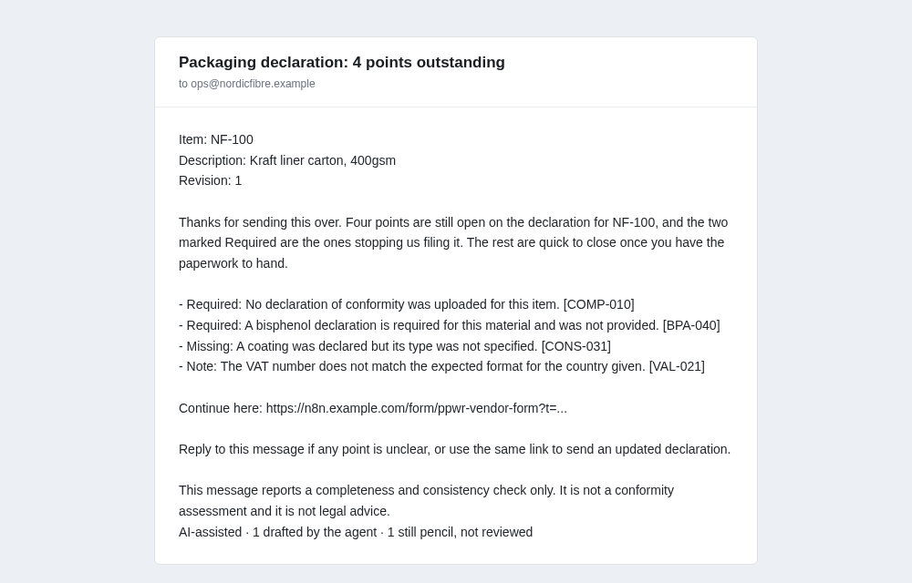
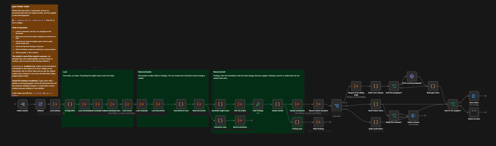

# PPWR Compliance Screener

Screens supplier packaging declarations for completeness and internal consistency.

You send each packaging supplier a signed link. They answer a questionnaire built from the ruleset
and upload their declaration. A deterministic rule engine screens what comes back, and the supplier
gets either a confirmation or a named list of what is missing. What you keep is a per-item evidence
file and a coverage report, ready to sit behind a Declaration of Conformity.

It runs on self-hosted n8n. Twelve workflows, one rule engine, and a store you can point at n8n Data
Tables today and Postgres when you outgrow them.

## What it looks like

The supplier gets a link and sees three pages. The first asks for nothing but a confirmation,
because a form trigger renders before any node can check the token.

| The questionnaire | The evidence page |
|---|---|
|  |  |

Page 2 is built from the ruleset's field catalogue, so adding a question means editing one JSON
file and nothing else.

What comes back when something is missing:



The paragraph at the top is the one thing a model wrote. Everything under it is rendered from the
finding rows in engine order, and the last line is the Article 50 marking, which is on this message
and not on a confirmation.

Inside n8n, `03-ppwr-intake-check` is where the loop closes:



## What this is not

Read this before anything else.

- **Not a conformity assessment.** It screens documents for completeness and internal consistency.
  It does not determine whether packaging conforms to Regulation (EU) 2025/40.
- **Not legal advice**, and not a substitute for a notified body or a competent authority.
- **Not a technical file.** It helps you assemble one.

Every supplier-facing message carries a one-line version of this, and every verdict record stores
the ruleset version that produced it. The ruleset in `rulesets/` is an example, built to exercise
every check type. Read it, change it, and have somebody qualified sign it off before you point it at
real suppliers.

[SCOPE.md](SCOPE.md) is the list of what is unfinished, by name.

## How it works

```
08 scope       load a supplier list, check it, and put the items in a campaign
01 launch      pick the items, mint one signed link per item, email each supplier once
02 form        the supplier fills in the questionnaire and uploads documents
03 intake      read the documents, merge with what was typed, run the engine, reply
   03b extract one document into structured fields
   05 engine   the verdict, deterministic and testable
04 chase       remind on a schedule, expire what has run out of time
06 review      a person decides what the engine could not
07 export      the dossier for one item, and the coverage report for the campaign
99 errors      one place every failure lands
00 store       the only workflow that touches the database
00 evidence    the only workflow that touches uploaded bytes
```

Most of this is deliberately boring. n8n carries the invitations, tokens, reminders, state
transitions and escalation, with every transition written to an event log. That is unglamorous work
which never needed a model.

**A model does exactly two jobs, both narrow.** It reads an uploaded document into named fields with
a confidence on each, and it drafts the covering paragraph of a gap notice.

**No model produces a pass or a fail.** Verdicts come from a rule engine evaluating a versioned JSON
ruleset. Adding a check means editing one JSON file, not adding a node. The same submission against
the same ruleset version produces the same findings in the same order, which is what lets an auditor
reconstruct a decision months later.

Two guards hold that boundary. Extraction fills blanks but never overrides a value the supplier
typed, and anything below the confidence floor leaves the field empty rather than letting a guess
become a finding. The drafting step is handed findings that are already final: it writes prose
around them, and any check identifier in that prose which is not in the notice is a hard error.

**Everything goes through one store and one evidence workflow.** Scattering Data Table nodes across
the other ten is the thing that would make this unforkable. Callers use logical field names and
never see a storage column.

## What you need

- Self-hosted n8n 2.x, with the Public API enabled
- Node 20 or newer, to run the installer once. Nothing to install with it
- A mail credential for the supplier messages
- An endpoint for a model that you configure and hold the key for, if you want document reading.
  Skip it and the screener still runs on typed answers alone
- A volume for evidence, because n8n 2.x will only let a node touch `~/.n8n-files`

Postgres is optional. The default store is n8n Data Tables, and `db/migrations/001_init.sql` is
generated from the same schema for when you outgrow them.

## Installing

Twelve workflows that call each other by name, eleven tables with a hundred and twelve columns
between them, and seventy eight sub-workflow references. One command does all of it:

```bash
export N8N_URL=https://n8n.example.com
export N8N_API_KEY=...
node install.js
```

It creates the tables, pushes the workflows, and then goes back over them and points every
reference at the copy it just made. That last step is separate because it has to be: half the
references point at workflows that do not exist until the push finishes.

`node install.js --dry-run` says what it would do and changes nothing. Run it again after pulling
a new release and it updates in place.

Give n8n somewhere to keep evidence. In your compose file:

```yaml
volumes:
  - n8n-evidence:/home/node/.n8n-files
```

then once, as the node user:

```bash
docker exec -u node n8n mkdir -p /home/node/.n8n-files/ppwr-evidence
```

Three credentials are left for you, because an API key cannot create one. The nodes show empty
slots where they belong: a mail credential, an HTTP header credential for your model endpoint, and
a generic credential holding a long random string, used to sign supplier links.

Runtime settings live in the `ppwr_meta` table rather than in this repository, so reinstalling
never overwrites what you configured: `llm_base_url`, `llm_model`, `operator_email`,
`reviewer_email`, `resume_url`, `send_notices`.

## Running a campaign

Open the form published by `08` and upload a supplier list. Required columns are
`vendor_legal_name`, `vendor_contact_email` and `internal_sku`; the rest of the packaging item
(`description`, `packaging_level`, `primary_material`, `food_contact`, `intended_use`) is optional.
Leave "Create the campaign" unticked the first time and it tells you what it would create, including
every row it cannot use and the line it is on.

Tick the box, upload again, and it creates the suppliers, the items and the campaign, and puts each
item in scope as `pending`. Nothing is sent. Uploading the same file twice is safe: a supplier is
matched on their contact email and an item on that supplier plus the SKU, so a corrected file only
creates what is new.

Then launch it with `01`, passing the `campaign_id` the loader handed back. Start with
`dry_run: true` to see the links without sending anything.

## Changing it

The rules live in `rulesets/`, and that is where most changes belong. A ruleset is versioned JSON:
each check names the fields it needs, the condition it applies and the message it produces. Adding a
check, changing a threshold or translating a message is an edit there, not a change to any workflow.

The engine that reads them is compiled into the Code nodes of `05-ppwr-rule-engine` and the store
workflow, unminified, so it is readable on the canvas. It is developed and tested in a private
working repository and exported here as a result, with the tests, fixtures and build tooling kept
out of the way. Editing a Code node in the n8n canvas works, and will be overwritten the next time
you run the installer against a new release.

The one property worth protecting if you do change it: the engine reads no clock, no random source
and no locale. A verdict has to replay identically a year later, which is the whole reason a rule
engine is here rather than a model.

## Data model

Eleven tables: `vendor`, `packaging_item`, `campaign`, `campaign_item`, `submission`, `document`,
`finding`, `event_log`, `review`, `draft`, `meta`. The schema the installer creates them from is the single
source of truth, and both the Data Table payloads and `db/migrations/001_init.sql` are generated
from it, so the two backends cannot drift.

Every state change writes an `event_log` row in the same call that changes the state. There is no
path that moves an item without leaving a trace.

## Rulesets

A ruleset is JSON: a field catalogue that drives the supplier form and the extraction prompt, and a
list of checks. Six check types are implemented: `required_fields`, `conditional_document`,
`date_window`, `regex_match`, `cross_field`, `enum_consistency`. Expressions are parsed by the
engine's own parser with three-valued logic, so a field nobody answered makes a check indeterminate
instead of failing it.

A campaign freezes a ruleset version and its hash at launch. Every submission under that campaign is
judged against that version, whatever you ship afterwards.

## EU AI Act

Output drafted through a language model carries Article 50 marking: a line a person can read and
metadata a machine can detect. Marking is conditional. Text a model wrote is marked, text assembled
deterministically is not, because marking everything would misstate provenance. The model is never
named in visible output. See [COMPLIANCE.md](COMPLIANCE.md).

## Licence

MIT. See [LICENSE](LICENSE) and [NOTICE](NOTICE).

## Governance

- [CONTRIBUTING.md](CONTRIBUTING.md) - how to propose a change
- [SECURITY.md](SECURITY.md) - how to report a vulnerability
- [CODE_OF_CONDUCT.md](CODE_OF_CONDUCT.md)
- [CHANGELOG.md](CHANGELOG.md)

Part of [Automatiqa Lab](https://www.automatiqa.io) by Aleks Sidorecs.
